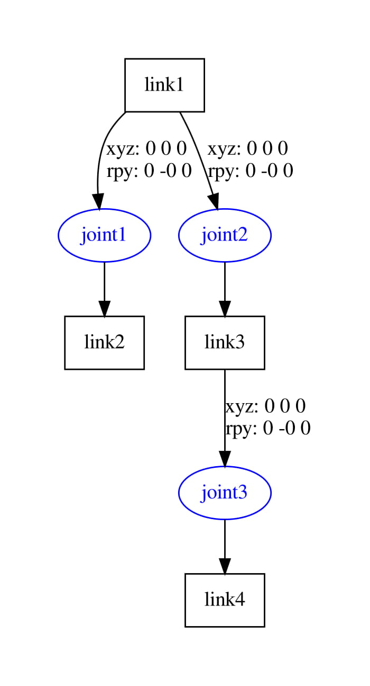

<div align="left">
  <a href="https://jovinsav.github.io/Rosworkshop/">HOME</a>
</div>

# URDF
URDF stands for ***'Unified Robot Description Format'***.
The Unified Robot Description Format (URDF) is an XML specification to describe a robot. We attempt to keep this specification as general as possible, but obviously the specification cannot describe all robots. The main limitation at this point is that only tree structures can be represented, ruling out all parallel robots. Also, the specification assumes the robot consists of rigid links connected by joints; flexible elements are not supported. The specification covers:

* Kinematic and dynamic description of the robot
* Visual representation of the robot
* Collision model of the robot


## how URDF is written
* XML formatTags:
* Tags like Robot link, joint,transmission, ... etc
* Kinematic tree structure
* Order in the file does not matter

---

## Lets Explore URDF files and tags
The URDF see URDF file for below Robot


A typical xml file for the Robot ***'test.urdf'***

***test.urdf***
```XML
<?xml version="1.0" encoding="UTF-8"?>
<robot name="test_robot">
     <link name="link1" />
      <link name="link2" />
     <link name="link3" />
     <link name="link4" />

     <joint name="joint1" type="continuous">
              <parent link="link1"/>
              <child link="link2"/>
             <origin xyz="5 3 0" rpy="0 0 0" />
     </joint>

     <joint name="joint2" type="continuous">
            <parent link="link1"/>
              <child link="link3"/>
                <origin xyz="-2 7 0" rpy="0 0 0" />
     </joint>

     <joint name="joint3" type="continuous">
     <parent link="link3"/>
     <child link="link4"/>
       <origin xyz="5 0 0" rpy="0 0 -1.57" />
     </joint>

   </robot>
```
you can run
```bash
 rosrun urdfdom_py display_urdf ~/ROS_Worksop/src/rosbasics/urdf/test.urdf
 ```
 which outputs
```
gazebos: []
joints:
- {axis: None, calibration: None, child: link2, dynamics: None, limit: None, mimic: None,
  name: joint1, origin: None, parent: link1, safety_controller: None, type: continuous}
- {axis: None, calibration: None, child: link3, dynamics: None, limit: None, mimic: None,
  name: joint2, origin: None, parent: link1, safety_controller: None, type: continuous}
- {axis: None, calibration: None, child: link4, dynamics: None, limit: None, mimic: None,
  name: joint3, origin: None, parent: link3, safety_controller: None, type: continuous}
links:
- collisions: []
  inertial: None
  name: link1
  origin: None
  visuals: []
- collisions: []
  inertial: None
  name: link2
  origin: None
  visuals: []
- collisions: []
  inertial: None
  name: link3
  origin: None
  visuals: []
- collisions: []
  inertial: None
  name: link4
  origin: None
  visuals: []
materials: []
name: test_robot
transmissions: []
version: '1.0'

```


As said urdf is the stadard used to represent robot structue we need to have urdf xml praser in our system which can be enabled by

```bash
sudo apt install liburdfdom-tools
```
and afer install
```bash
urdf_to_graphiz ~/ROS_Worksop/src/rosbasics/urdf/test.urdf
```
which out puts


---

> all dimetions are in SI units and base_link frame  of Myfirst robot

# NOTE
> A Robot discription without dimensions is meaniningless lets add dimentions

---
# Create A launch file  
> ROS has splitted a package as useage increased **joint_state_publisher** to ***'joint_state_publisher_gui'***
to install it
```bash
sudo apt-get update
sudo apt-get install ros-melodic-joint_state_publisher_gui
```

***'urdf.launch'***

```xml

<?xml version="1.0" encoding="UTF-8"?>
<launch>
  <arg name="model" default="box.urdf" />
  <arg name="file" default="$(find rosbasics)/urdf/$(arg model)"/>
   <arg name="gui" default="false" />
  <param name="robot_description" command="$(find xacro)/xacro --inorder $(arg file)" />
 <param name="use_gui" value="$(arg gui)"/>

 <node name="joint_state_publisher" pkg="joint_state_publisher_gui" type="joint_state_publisher_gui" />
 <node name="robot_state_publisher" pkg="robot_state_publisher" type="robot_state_publisher" />

</launch>
```
---

# Lets create shapes
## BOX

**box.urdf**

```XML
<?xml version="1.0" encoding="UTF-8"?>
<robot name="box">
  <link name="base_link">
    <visual>
      <geometry>
        <box size= "1 1 1"/>
      </geometry>
    </visual>
  </link>
</robot>
```
## CYLINDER

**cylinder.urdf**

```XML
<?xml version="1.0" encoding="UTF-8"?>
<robot name="cylinder">
  <link name="base_link">
    <visual>
      <geometry>
        <cylinder radius="1.0" length="3"/>
      </geometry>
    </visual>
  </link>
</robot>
```

* open terminal

 ```bash
roslaunch roslaunch roslaunch rosbasics urdf.launch model:=box.urdf
 ```
 
 <video width="600" height="240" controls preload>
    <source src="rviz-2020.mp4"></source> 
</video>

 ---
<div align="left">
  <a href="https://jovinsav.github.io/Rosworkshop/chapter6.html">Back to:Chapter 6</a>
</div>

<div align="right">
  END
</div>

